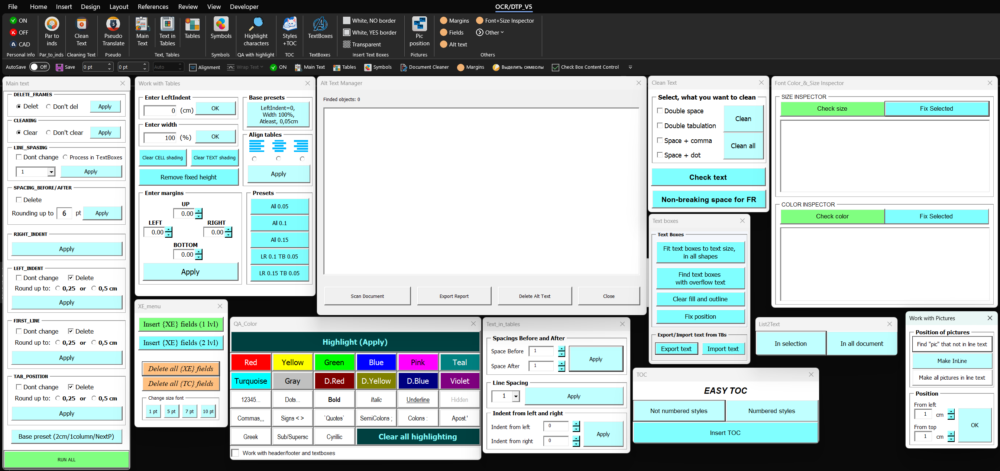
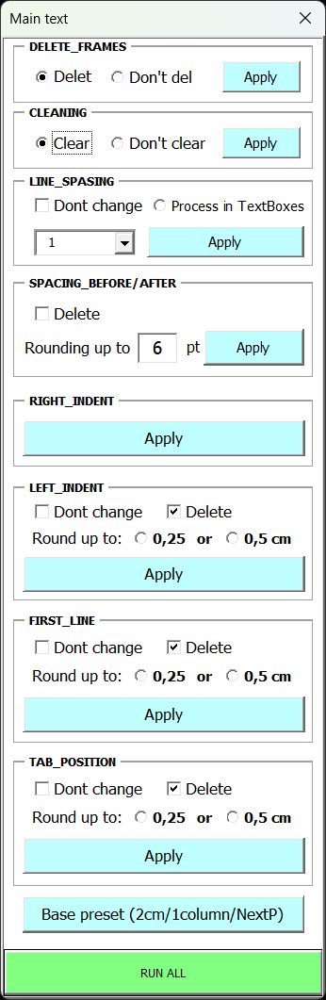
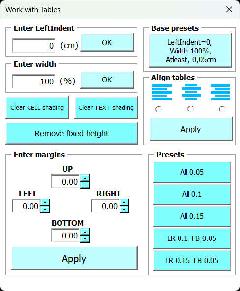
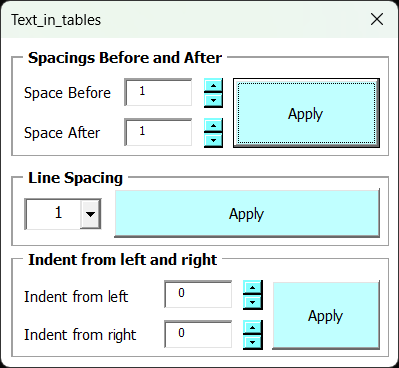
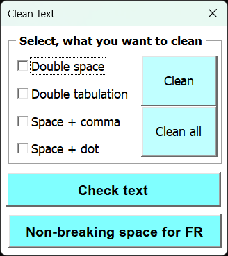
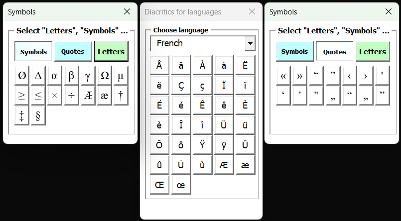
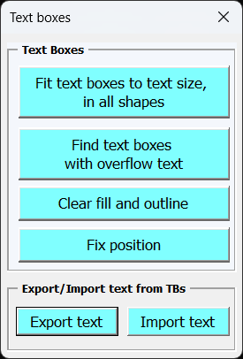
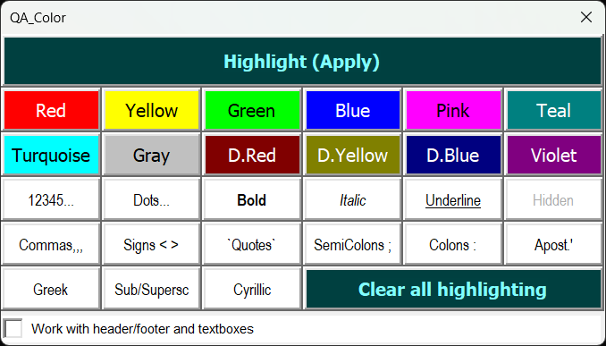
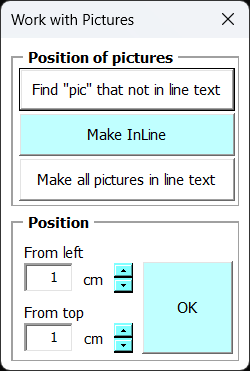
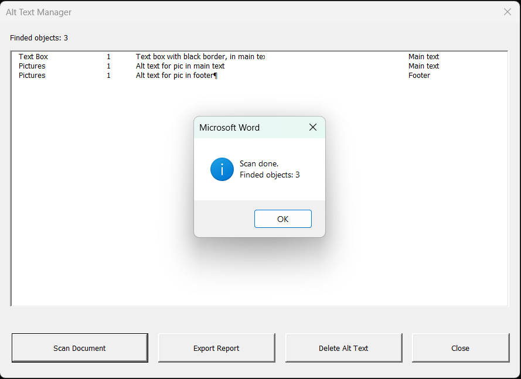

# 🛠️ Набор VBA-макросов и форм для Microsoft Word

Коллекция практичных макросов и интерактивных форм для Microsoft Word, предназначенная для автоматизации рутинных задач: работы с графикой, форматированием текста, локализацией и безопасности документов.

---

## 📋 Обзор возможностей

Основное преимущество всех макросов, это обработка всего документа! Теперь не нужно форматировать каждую таблицу, каждый абзац, текстовое поле и т.д.

Набор содержит 10 ключевых модулей:

1. **Форматирование текста**
2. **Форматирование таблиц**
3. **Обработка текста в таблицах**
4. **Очистка текста**
5. **Быстрая вставка часто используемых символов**
6. **Текстовые блоки**
7. **Помощник при визуальной проверке**
8. **Изображения, позиционирование в тексте**
9. **Работа с альтернативным текстом различных элементов.**< /br>
10.**Исправление разности размеров и цветов текста в одном предложении/абзаце.**

---

## 🚀 Подробное описание модулей

### 1. Форматирование текста

Что делает макрос:
- Удаляет мусорные элементы: Вычищает фреймы (Frames) и приводит сжатый/растянутый шрифт и межзнаковый интервал к стандартным значениям.
- Сбрасывает структуру: Переводит документ в 1 колонку и задает одинаковые поля для всех секций.
- Оптимизирует отступы и табуляцию: Удаляет или округляет левый отступ, отступ первой строки и позиционирование табуляции до кратных значений (0.25см или 0.5см).
- Настраивает интервалы: Задает единый межстрочный интервал (присутствует расширенный диапазон), обнуляет правые отступы и регулирует/удаляет интервалы до и после абзацев.
- Автоматизирует процесс: С помощью одной кнопки, запускает все этапы пакетной обработки за один клик, отображая прогресс в строке состояния.

Чем он полезен:
- Экономия времени: Автоматизирует рутинную ручную правку кривой верстки за секунды.
- Приведение к стандарту: Позволяет быстро «причесать» сторонний или плохо оформленный текст к единому стилю оформления.
- Устранение багов верстки: Удаляет скрытые проблемы шрифтов и съехавшую табуляцию, делая документ предсказуемым для дальнейшего редактирования.

  

---

### 2. Форматирование таблиц

Что делает макрос:
- Очищает заливку
- Снимает фоновый цвет ячеек и заливку самого текста внутри них.
- Управляет размерами и выравниванием
- Настраивает ширину таблиц в процентах, левый отступ, выравнивание по левому краю, центру или правому краю.
- Настраивает поля ячеек (отступы), позволяет задать пользовательские внутренние поля для ячеек или применить готовые пресеты.
- Исправляет высоту строк, снимает фиксированную высоту строк, задавая режим «минимум», чтобы текст не обрезался.

Чем он полезен:
- Устраняет дефекты верстки: Быстро исправляет обрезающиеся строки, «съехавшие» границы и лишнюю заливку в таблицах, скопированных из веб-страниц или сторонних файлов. 
- Приводит к единому стилю: Позволяет за один клик отформатировать десятки таблиц в документе по единым стандартам.
- Экономит время: Ручная настройка полей ячеек и ширины для множества таблиц занимает много времени, а макрос делает это автоматически.

  

---

### 3. Обработка текста в таблицах

Что делает макрос:
- Точечная настройка форматирования абзацев внутри всех таблиц документа.
- Управляет интервалами до и после абзацев.
- Задает левый и правый отступ текста.
- Изменяет межстрочный интервал, применяет выбранный из списка множитель (от 1 до 1,5) к каждому абзацу внутри таблиц.

Чем он полезен:
- Контроль оформления табличного текста.
- Позволяет быстро подогнать компактность текста внутри всех таблиц без изменения основного текста документа.
- Избавляет от необходимости выделять каждую таблицу вручную и заходить в настройки абзаца.

  

---

### 4. Очистка текста

Что делает макрос:
- Автоматическая чистка, удаляет типичные ошибки набора.
- Заменяет двойные пробелы на одинарные.
- Множественные знаки табуляции на одиночные.
- Убирает ошибочные пробелы перед запятыми, точками, и т.д.
- Исправляет французскую/европейскую типографику, заменяет обычные пробелы на неразрывные перед знаками (: ; ! ?), а также внутри кавычек-елочек (« и »), чтобы предотвратить оторванные знаки при переносе строк.

Чем он полезен:
- Ускоряет корректуру. За доли секунды убирает «мусорные» пробелы и знаки, на поиск которых вручную ушли бы десятки минут. Проверяет качество текста: Функция подсчета позволяет быстро оценить, насколько неаккуратно сверстан или набран поступивший документ. Улучшает внешнее оформление (типографику). Автоматическая установка неразрывных пробелов гарантирует, что кавычки и знаки препинания не перенесутся на новую строку отдельно от текста.

  

---

### 5. Часто используемые символы

Что делает макрос:
- Форма представляет собой заготовку из частоиспользуемых символов. 
Данный макрос является заменой стандартной функции в ворде "Insert symbol".

Чем он полезен:
- Основное преимущество в том, что все часто используемые символы всегда на виду (модульное окно). 
- Кроме спец символов и греческих букв, можно переключится на выбор всех видов кавычек, а так же предусмотрено отдельное окно для отображения диакритических символов (для различных языков), которые не всегда удобно/возможно ввести с клавиатуры.

  

---

### 6. Текстовые блоки

Что делает макрос:
- Комплексное управление надписями (Text Frame / TextBox).
- Подгонка надписей под текст (после перевода текст может не помещаться в надпись)
- Очистка границ и заливки.
- Экспорт/импорт содержимого текстовых надписей.
- Двуязычный перевод и локализация. Экспорт - собирает текст из всех надписей документа и формирует двухколоночную таблицу-легенду  в отдельном файле D:\Legend.docx. Импорт - считывает переведенный текст из 2-й колонки первой таблицы активного документа и автоматически вставляет его обратно в соответствующие надписи по их индексам.

Чем он полезен:
- После перевода, часть текста никогда не будет скрыта за гранью надписи, так как они автоматически подстраиваются под объем содержащегося в них текста, устраняя пустые поля или обрезанные слова.
- Поиск переполненных текстовых блоков, проверяет свойство .TextFrame.Overflowing и выводит сообщение с номерами страниц, на которых текст не помещается в границы блоков.
- Фиксация привязки, запирает якорь надписей и переводит координаты позиции в абсолютные относительно страницы.

  

---

### 7. Помощник при визуальной проверке (проверка "ЦВЕТОМ")

Этот код представляет собой модуль формы VBA для умной подсветки и поиска элементов текста в документах Word.

Основной функционал макроса:
Интерактивный интерфейс:
- 12 цветов выделения. Динамически настраивает палитру (Красный, Желтый, Зеленый и т.д.) с соответствующими фоновыми цветами RGB на кнопках. Выбор цвета сделан взаимоисключающим (выбор одного сбрасывает остальные).

- 15 категорий поиска. Позволяет выбрать, что именно нужно подсветить. Выбор категории также взаимоисключающий.

Категории поиска и форматирования: Цифры ([0-9]), Знаки препинания (точки, запятые, двоеточия, точки с запятой, апострофы).
Спецсимволы и знаки: Операторы < >, кавычки разных типов (включая ёлочки «» и лапки “”), греческие буквы, кириллица.
Форматирование: Скрытый текст, Жирный (Bold), Курсив (Italic), Подчеркнутый текст (различных типов) и Индексы (Верхний/Нижний Sub/Superscript).

Гибкая область применения:
Обычный режим: Подсвечивает/очищает выбранные элементы только в основном теле документа.
Режим "All": Сканирует абсолютно все области документа (StoryRanges — колонтитулы, сноски, надписи) и текстовые блоки (Shapes / TextBoxes).

Очистка выделения:
В один клик снимает абсолютно все цветные выделения в документе или во всех его блоках.

  

---

### 8. Изображения, позиционирование в тексте

Этот код предназначен для управления обтеканием и точным позиционированием изображений в документе MS Word.

Основной функционал макроса:
- Сканирует документ на наличие "плавающего" изображения. При нахождении первого такого рисунка выделяет его и прокручивает экран к его позиции. При необходимости жестко позиционирует его.
- Преобразует абсолютно все плавающие изображения (Shapes) в документные объекты «В тексте» (InlineShapes), а также выравнивает их по левому краю.
- Переводит выделенный рисунок в плавающий режим, привязывает его к странице (LockAnchor = True) и смещает по координатам X и Y (в сантиметрах), указанными пользователем.

  

---

### 9. Сканер альтернативного текста

Этот код предназначен для управления обтеканием и точным позиционированием изображений в документе MS Word.

Основной функционал макроса:
- Сканирует документ на наличие "плавающего" изображения. При нахождении первого такого рисунка выделяет его и прокручивает экран к его позиции. При необходимости жестко позиционирует его.
- Преобразует абсолютно все плавающие изображения (Shapes) в документные объекты «В тексте» (InlineShapes), а также выравнивает их по левому краю.
- Переводит выделенный рисунок в плавающий режим, привязывает его к странице (LockAnchor = True) и смещает по координатам X и Y (в сантиметрах), указанными пользователем.

  

---

### 10. Исправление разности размеров и цветов текста в одном предложении

Этот код реализует инструмент форматирования документа Word, который находит абзацы со смешанными размерами шрифтов (часть 1) и смешанными цветами текста (часть 2), а затем автоматизирует их исправление.
Основной функционал:
- Поиск неоднородностей. Перебирает абзацы документа и проверяет, есть ли в пределах одного абзаца разные размеры или цвета.
- Проблемные абзацы заносятся в списки с их индексами. Навигация по документу, двойной клик по элементу списка мгновенно выделяет соответствующий абзац в документе MS Word.
- Автоматическое исправление. Алгоритм перебирает каждый символ в выбранном абзаце и высчитывает частоту использования каждого размера/цвета. Находит доминирующий размер или цвет (самый частый) и применяет его ко всему абзацу, после чего удаляет исправленный элемент из списка.

  

---

Помимо основных макросов, присутствуют и другие помощники, зачастую они не требуют пользовательской формы (UI):

**Очистка метаданных и конфиденциальности** (DTP_PERSONAL_INFO)
- VBA-код предназначен для интеграции с лентой Word (Ribbon UI) и отвечает за очистку документа от конфиденциальных данных и метаданных (аналог функции «Инспектор документов» / Document Inspector), а также за управление приватностью при сохранении.
- При необходимости, одним кликом можно снять ограничение, тогда Word может сохранять имя автора, дату создания и свойства файла в будущем.
---
**Быстрое удаление закладок, и рамок (старые версии текстовых надписей)** (DTP_DELETE_FRAMES / DTP_DELETE_BOOKMARKS)
Этот модуль VBA содержит две процедуры для пользовательской ленты Word (Ribbon UI), предназначенные для быстрой очистки документа от кадров (Frames) и закладок (Bookmarks).
---
**Помощник при подготовке легенды для Auto_CAD** (DTP_CAD)
Этот модуль VBA предназначен для автоматической скрытельской подготовки чертежного или технического документа (DTP/CAD-подготовка к переводу). Он находит и делает скрытым определенный сервисный текст, служебные теги AutoCAD, текст определённых цветов и первые столбцы таблиц.
---
**Замена символа пустых абзацев, на отступы** (DTP_PARAGRAPHS_TO_INDENTS)
Этот макрос предназначен для автоматической заменя пустых абзацев на вертикальные отступы (SpaceBefore) перед следующими за ними абзацами.
Функция полезна при верстке и чистке документов Word (DTP/препресс), где использование пустых строк для создания межстрочных интервалов считается некорректным форматированием.
Пустой абзац удаляется (с запоминанием его размера), после размер абзаца прибавляется к полю SpaceBefore первого непустого абзаца, идущего следом.
---
**Псевдо перевод** (DTP_PSEUDO_TRANSLATE)
Этот макрос предназначен для автоматической замены любых символов в ворде на символ ($).
Ускоренная версия псевдо перевода в Традосе, но без необходимости создания проекта в САТ системе. 
Помогает при оценке документа, выявлять "не живой" текст, который необходимо подготовить. 
---
**Быстрое вкл/выкл., полей и границ текста** (DTP_FIELDS / DTP_MARGINS)
Этот VBA-модуль предназначен для быстрого переключения режимов отображения сервисных элементов интерфейса MS Word (серый фон полей и границы текста).
Обе процедуры используются при верстке, предпечатной подготовке (DTP) или контроле документов перед экспортом.
---
**Быстрое создание стилей, для правильного оглавления** (DTP_TOC)
Создает кастомные пользовательские стили заголовков (H1–H5), привязывает их к многоуровневому нумерованному (или не нумерованному) списку (формата 1., 1.1., 1.1.1. и т.д.) и применяет стиль H1 к текущему выделению.
Автоматически вставляет поле Оглавления (TOC) на основе уровней структуры документа с гиперссылками номероми страниц.
---
**Index / XE fields** (DTP_XE)
Представленный набор процедур — это полноценная система автоматизации авторского и предметного указателя (Index / XE fields) для верстки книг, словарей и справочников.
Управление размером - изменяют гарнитуру (Arial Narrow) и кегль (1pt, 5pt, 7pt, 10pt) для кода полей предметного указателя (XE). Зачем нужно: Уменьшение кегля до 1pt («микрошрифт») предотвращает сдвиг и сбой верстки страниц, когда включает/выключает видимость непечатаемых знаков в Word.

Главное преимущество - это:
- АВТОМАТИЧЕСКАЯ разметка одноуровневого указателя из внешнего Word-файла):
Читает внешнюю таблицу Word (Термин | Страницы, через запятую).
Находит указанные страницы в целевом документе и автоматически расставляет поля { XE "Термин" } в конец страницы (или перед разрывом раздела/страницы).
Автоматически выводит поле из таблиц, чтобы избежать сбоев генерации.

- АВТОМАТИЧЕСКАЯ разметка иерархического двухуровневого указателя):
Читает таблицу, где полужирным шрифтом в строках из 1 ячейки задается Главный термин (parentTerm), а в строках из 2 ячеек — Подтермин (childTerm) и его страницы.
Формирует поля вида { XE "Главный термин:Подтермин" }
ОЧЕНЬ ЭКОНОМИТ ВРЕМЯ ПРИ СОЗДАНИИ СЛОВАРЯ (Index)
---
**Index / XE fields** (DTP_XE)
Представленный набор процедур — это полноценная система автоматизации авторского и предметного указателя (Index / XE fields) для верстки книг, словарей и справочников.
Управление размером - изменяют гарнитуру (Arial Narrow) и кегль (1pt, 5pt, 7pt, 10pt) для кода полей предметного указателя (XE). Зачем нужно: Уменьшение кегля до 1pt («микрошрифт») предотвращает сдвиг и сбой верстки страниц, когда включает/выключает видимость непечатаемых знаков в Word.

Главное преимущество - это:
- АВТОМАТИЧЕСКАЯ разметка одноуровневого указателя из внешнего Word-файла):
Читает внешнюю таблицу Word (Термин | Страницы, через запятую).
Находит указанные страницы в целевом документе и автоматически расставляет поля { XE "Термин" } в конец страницы (или перед разрывом раздела/страницы).
Автоматически выводит поле из таблиц, чтобы избежать сбоев генерации.

- АВТОМАТИЧЕСКАЯ разметка иерархического двухуровневого указателя):
Читает таблицу, где полужирным шрифтом в строках из 1 ячейки задается Главный термин (parentTerm), а в строках из 2 ячеек — Подтермин (childTerm) и его страницы.
Формирует поля вида { XE "Главный термин:Подтермин" }
ОЧЕНЬ ЭКОНОМИТ ВРЕМЯ ПРИ СОЗДАНИИ СЛОВАРЯ (Index)
---

